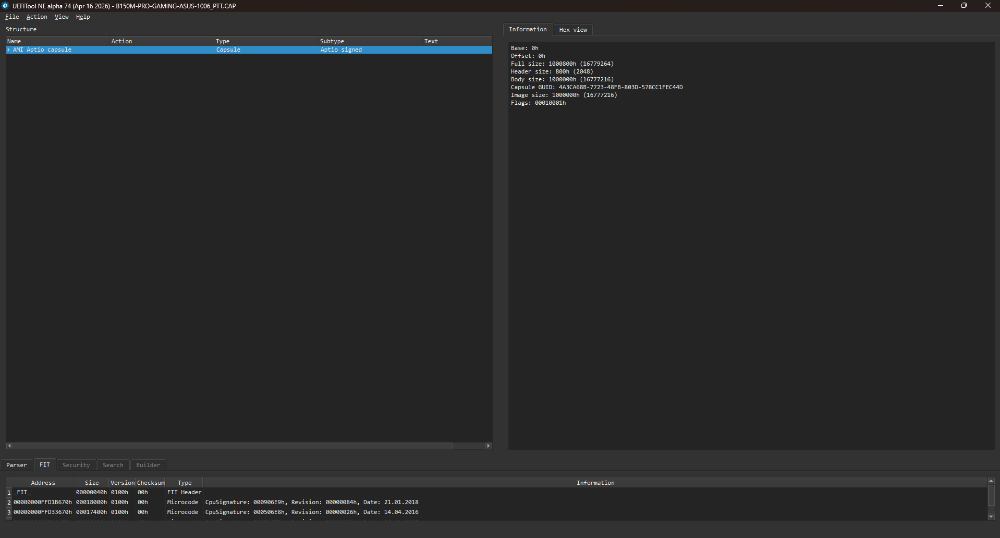
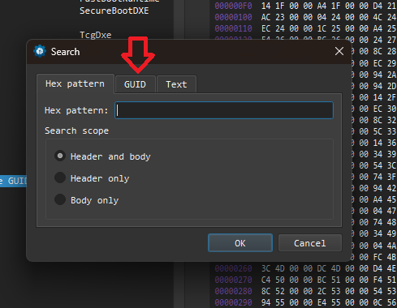
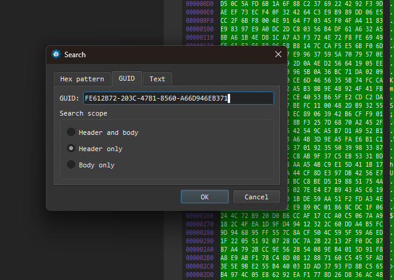
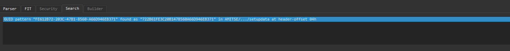
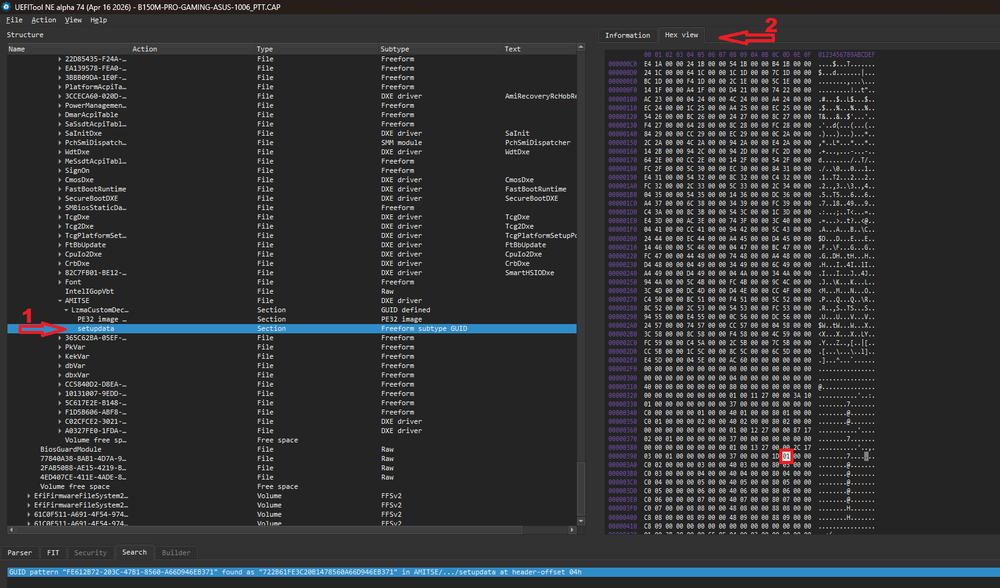

# ASUS B150M Pro Gaming — PTT Enabler (TPM 2.0)

Enables Intel PTT (Platform Trust Technology / TPM 2.0) on the **ASUS B150M Pro Gaming** motherboard, unlocking Windows 11 compatibility without requiring a discrete TPM module.

> Tested on BIOS version 1006 with Intel Core i5-6600K (Skylake, LGA1151).  
> Should work for any 6th or 7th gen Intel CPU (Skylake / Kaby Lake) on this board.

---

## Disclaimer

> This project does not distribute modified BIOS files. The patch is applied by the user on the original firmware downloaded directly from ASUS. Use at your own risk. The author is not responsible for any damage to your hardware.

---

## Why

The ASUS B150M Pro Gaming does not expose the PTT option in its BIOS interface, even on the latest official firmware. However, the firmware **does include the `AsusPTTDxe` module** — PTT support is present but hidden.

This tool patches a single byte in the firmware's NVRAM defaults to expose the **PCH-FW Configuration** menu and enable Firmware TPM (PTT).

---

## How it works

The patch modifies offset `0x389` in the `FE612B72-203C-47B1-8560-A66D946EB371` setupdata section from `0x00` (disabled) to `0x01` (enabled). 

The patch does not modify any executable code — only NVRAM defaults.

---

## Before Starting

You can just edit NVRAM without flashing using [modGRUBShell.efi](https://github.com/datasone/grub-mod-setup_var/releases), it's more safe than flashing your own patched BIOS, if you're not sure about what option to choose, just use the GRUB setup_vars path [GRUB method](#alternative--no-flash-required-temporary).

If you're confident, you can flash your patched BIOS just use the script to generate an patched BIOS using the BIOS Flashing path [BIOS Flashing Method](#bios-flashing).

---

## BIOS Flashing

### Requirements

- Python 3.x
- `UEFIReplace` from [UEFITool NE](https://github.com/LongSoft/UEFITool/releases/tag/0.28.0) — place it in the same folder as the script or add it to PATH
- `UEFIExtract` from [UEFITool NE](https://github.com/LongSoft/UEFITool/releases/tag/A74) — place it in the same folder as the script or add it to PATH
- The original BIOS CAP file downloaded from the [ASUS BIOS Download](https://www.asus.com/supportonly/b150m_pro_gaming/helpdesk_bios/)

### Script Usage
```bash
# Windows
python patch_ptt.py B150MPROGAMING.CAP

# Linux / macOS
python3 patch_ptt.py B150MPROGAMING.CAP

# Custom output file
python3 patch_ptt.py B150MPROGAMING.CAP -o B150MPROGAMING_PTT.CAP

# Custom UEFIReplace path
python3 patch_ptt.py B150MPROGAMING.CAP --uefi-replace /path/to/UEFIReplace
```

The script will generate a patched CAP file (e.g. `B150MPROGAMING_PTT.CAP`) ready to flash.


### Checking that the patched BIOS is really patched

1. Download UEFITool [UEFITool](https://github.com/LongSoft/UEFITool/releases) (I'm using the release A74)

2. Open UEFITool and press CTRL+O, select the patched BIOS file, you should see something like this.



3. Press CTRL+F, you should see an windows like this.



4. Click on GUID, and search for `FE612B72-203C-47B1-8560-A66D946EB371`



5. You should see the GUID pattern found in the search bar at the bottom of the window.



6. Now go to the setupdata at the tree view and open the Hex View at left corner of the screen, you should see `01` at row `00000390` column `0D`



This means that the patch was done successfully, you can now flash it onto your motherboard.

### Flashing

1. Copy the patched `.CAP` to the root of a **FAT32 USB drive**
2. Enter BIOS (press `Del` on boot)
3. Go to **Tool → ASUS EZ Flash**
4. Select the USB drive and the `.CAP` file
5. Confirm and wait for the flash to complete — **do not power off the PC**

### Enabling PTT after flashing

1. Enter BIOS (press `Del` on boot)
2. Go to **Advanced → PCH-FW Configuration**
3. Set **TPM Device Selection** to **Firmware TPM**
4. Press `F10` to save and reboot

To verify in Windows: press `Win+R`, type `tpm.msc` — it should show **TPM ready, Specification Version: 2.0**.

---

## Alternative — no flash required (temporary)

If you prefer not to modify the firmware, you can enable PTT temporarily using the GRUB shell. The setting persists across reboots but resets if you load BIOS defaults or remove the CMOS battery.

1. Download [modGRUBShell.efi](https://github.com/datasone/grub-mod-setup_var/releases)
2. Create a FAT32 USB drive with this structure:
   ```
   EFI/
   └── BOOT/
       └── BOOTx64.efi  ← rename modGRUBShell.efi to this
   ```
3. Boot from the USB drive
4. In the GRUB shell, type:
   ```
   setup_var 0x389 0x1
   reboot
   ```
6. Enter BIOS (press `Del` on boot)
7. Go to **Advanced → PCH-FW Configuration**
8. Set **TPM Device Selection** to **Firmware TPM**
9. Press `F10` to save and reboot

---

## References

- [Win-Raid Forum — ASUS B150M Pro Gaming TPM 2.0](https://winraid.level1techs.com/t/problem-asus-b150m-pro-gaming-with-active-tpm-2-0/112661)
- [UEFITool by LongSoft](https://github.com/LongSoft/UEFITool)
- [grub-mod-setup_var by datasone](https://github.com/datasone/grub-mod-setup_var)